# Android NAS

This repository turns an Android phone running Termux into a primary mobile storage device for `rclone`, with a Mac client and a USB stick as a movable secondary source.

It is designed for a 3-device workflow:

- the Mac is the active client where work happens
- the Android phone is the 1st device and primary source
- the USB stick is the 3rd device and secondary source

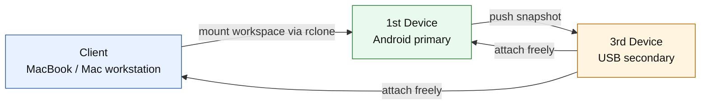

## Definitions

- `client`: the MacBook or Mac workstation where the user actively works
- `1st device`: the Android phone running Termux, acting as the primary mobile source
- `3rd device`: the USB stick, acting as a movable secondary source that can attach to the client or the 1st device
- `primary`: the authoritative remote source, normally the Android phone
- `secondary`: the USB stick, used for handoff, fallback, and shuttle sync
- `workspace`: one top-level folder such as `projects`, `experiments`, `claude`, `backups`, or `shared`
- `spaceless cache`: client mode that minimizes local `rclone` VFS cache usage by using `--vfs-cache-mode off`
- `primary sync timestamp`: a manifest written to the USB after a completed sync from the primary device
- `secondary access timestamp`: a manifest written by the client when it sees and links the USB device
- `source policy`: `primary_preferred_secondary_continuity`, meaning the Android primary is preferred when reachable and the USB is used for continuity rather than silent authority promotion

## Repository Contents

- `scripts/setup-nas-termux.sh`: Android setup for the 1st device
- `scripts/setup-nas-mac.sh`: macOS setup for the client
- `scripts/nas-mount`: mount one workspace from the Android primary on the client
- `scripts/nas-unmount`: unmount the current client workspace
- `scripts/nas-switch`: switch the active workspace
- `scripts/nas-status`: show client status, mount state, and device availability state
- `scripts/nas-doctor`: verify client setup
- `scripts/nas-android-doctor`: verify Android primary setup
- `scripts/nas-android-usb-sync`: sync Android primary data to or from the USB
- `scripts/nas-android-usb-watch`: Android watcher for USB insertion
- `scripts/nas-mac-usb-watch`: client watcher for USB insertion and mobile availability
- `scripts/nas-usb-mount`: link the USB secondary on the client
- `scripts/nas-usb-attach`: explicit alias for attaching the USB secondary on the client
- `scripts/nas-mobile-usb-sync`: client-side primary-to-USB refresh and manual USB-to-primary recovery helper

## Topology

The Android primary exports:

```text
/storage/emulated/0/nas/
├── projects
├── experiments
├── claude
├── backups
└── shared
```

The client mounts one workspace at a time to:

```text
~/mnt/android-nas/<workspace>
```

The USB secondary is linked on the client at:

```text
~/mnt/android-nas-usb
```

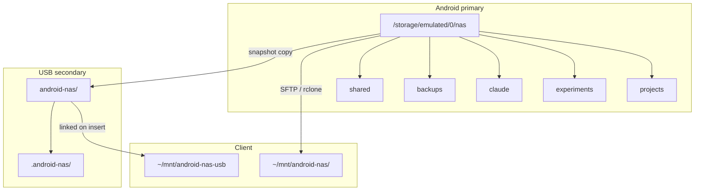

## Use Case Scenarios

### Scenario 1: Normal online use

The Android primary is reachable on Wi-Fi and the client mounts directly from it.

```text
client -> Android primary
```

Typical flow:

1. `nas-status`
2. `nas-mount`
3. work on the client
4. `nas-unmount` when done

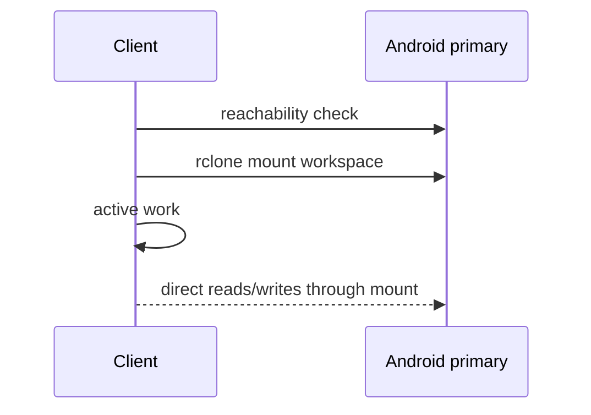

### Scenario 2: Android primary is taken away

The user plugs the USB stick into the Android primary, lets it receive the latest snapshot, then moves the USB to the client.

```text
Android primary -> USB secondary -> client
```

Expected behavior:

- Android detects the USB and pushes newer files to it
- the USB receives a completed primary sync timestamp
- the client attaches the USB when inserted
- if the Android primary is unavailable, the client can still use the USB as a trusted secondary continuity source if the timestamp exists

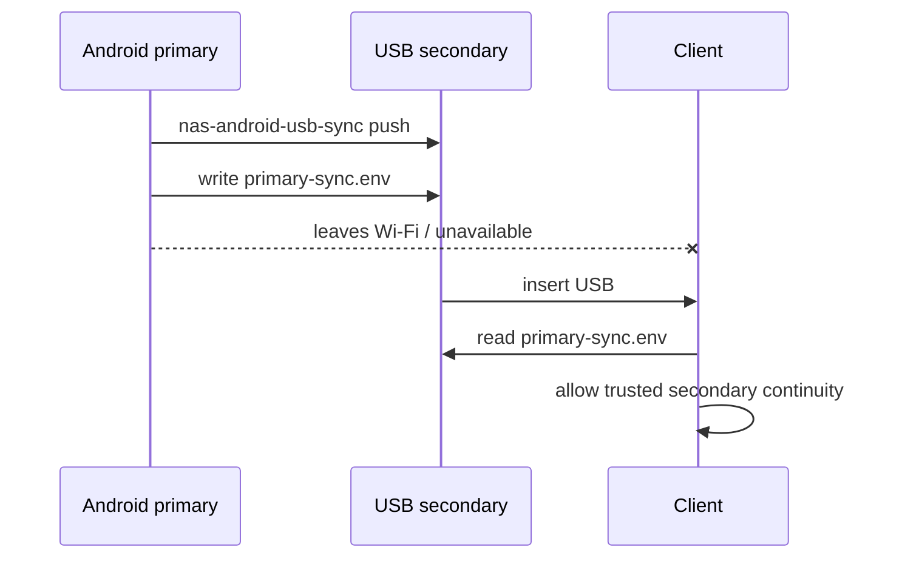

### Scenario 3: USB inserted while Android primary is unavailable

The client checks whether the USB can prove a completed sync from the Android primary.

Expected behavior:

- if `primary-sync.env` exists and shows a completed sync, the client treats the USB as a valid secondary continuity source
- if no completed primary sync timestamp exists, the client shows a warning notification

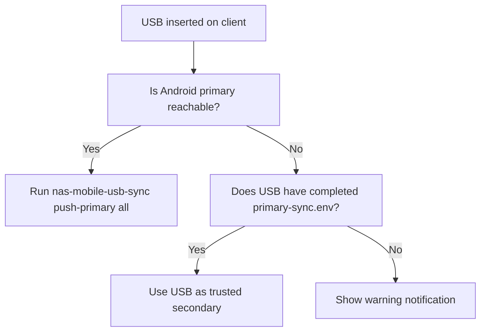

### Scenario 4: Low-space client

The client must avoid local VFS cache growth.

Expected behavior:

- set `CLIENT_CACHE_MODE=spaceless`
- the client mount uses `rclone --vfs-cache-mode off`
- availability warnings and USB trust checks still work

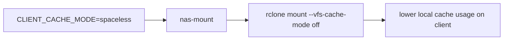

## Availability and Notifications

The client tracks and reports availability state transitions for:

- `PRIMARY_STATE`: Android primary
- `USB_STATE`: USB secondary

The Android primary reports sync status for USB push/pull operations through Termux notifications when Termux:API is installed.
It can also keep a persistent ongoing notification with quick actions so the operator can trigger a manual USB refresh from the phone.

The client shows macOS notifications when:

- the Android primary becomes unavailable
- the USB secondary becomes unavailable
- the USB secondary is present but cannot prove a completed sync from the Android primary

Routine informational state changes stay quiet by default. Warning popups remain enabled by default.

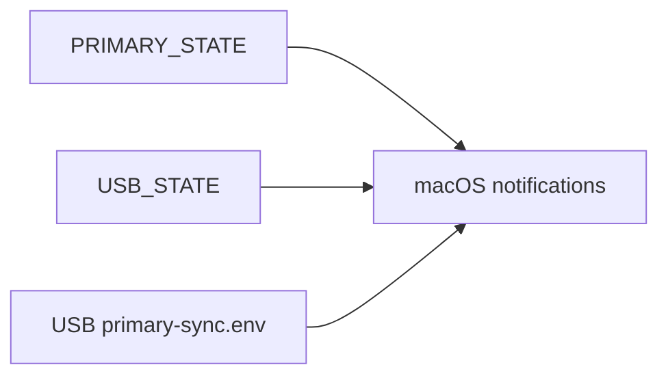

## Prerequisites

### Android primary

- Termux installed
- Termux:Boot installed and opened once
- Termux:API installed if notifications are wanted
- shared storage permission granted to Termux

### Client

- macOS
- `bash`
- `rclone`
- a FUSE backend for `rclone mount`

## Setup

### One-command GitHub install

macOS:

```bash
bash <(curl -fsSL https://raw.githubusercontent.com/minthanthtoo/android-nas/main/scripts/install-from-github.sh)
```

Android / Termux:

```bash
curl -fsSL https://raw.githubusercontent.com/minthanthtoo/android-nas/main/scripts/install-from-github.sh | bash
```

The bootstrap downloads the repository into:

```text
~/.local/share/android-nas/repo
```

and then runs the platform-specific setup script from that local copy.

### Android primary setup

Run on the Android phone in Termux:

```bash
bash scripts/setup-nas-termux.sh
nas-android-doctor
```

This installs:

- `openssh`
- `rsync`
- `termux-services`
- `rclone`
- `termux-api`
- Android USB helper commands
- a Termux:Boot script that starts `sshd` and the USB watcher

### Client setup

Run on the Mac:

```bash
bash scripts/setup-nas-mac.sh
nas-doctor
```

This installs:

- client commands in `~/.local/bin`
- client config in `~/.config/android-nas/config.env`
- runtime state in `~/.local/state/android-nas/`
- a `.zshrc` PATH entry for `~/.local/bin` when needed
- a LaunchAgent for the USB watcher by default

If the `rclone` SFTP remote is not configured yet, setup still succeeds with `REMOTE=NAS`. Configure the remote afterward with:

```bash
rclone config
```

To install the client without the LaunchAgent:

```bash
bash scripts/setup-nas-mac.sh --no-agent
```

## Setup Flow

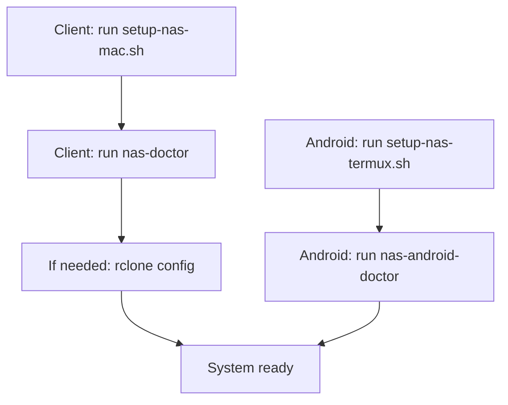

## Client Configuration

The generated client config contains:

```bash
REMOTE=NAS
REMOTE_FALLBACK=android
BASE_PATH=/storage/emulated/0/nas
WORKSPACE=projects
MOUNT_ROOT=$HOME/mnt/android-nas
SOURCE_POLICY=primary_preferred_secondary_continuity
CLIENT_CACHE_MODE=full
USB_SUBDIR=android-nas
USB_ROOT=
USB_LINK_PATH=$HOME/mnt/android-nas-usb
MAC_NOTIFY_INFO=0
MAC_NOTIFY_WARN=1
USB_SYNC_MAX_AGE_HOURS=168
```

Cache modes:

- `SOURCE_POLICY=primary_preferred_secondary_continuity`: prefer Android primary when reachable and treat the USB as a continuity source
- `CLIENT_CACHE_MODE=full`: normal VFS cache behavior
- `CLIENT_CACHE_MODE=spaceless`: low-space mode, maps to `--vfs-cache-mode off`
- `CLIENT_CACHE_MODE=writes`: write-oriented VFS caching

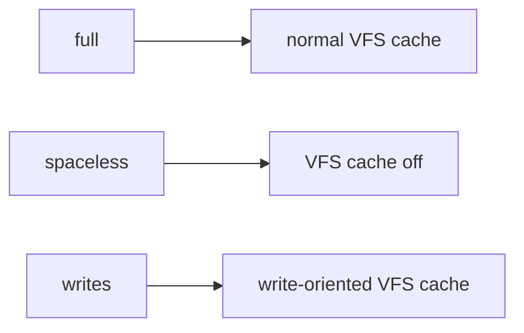

## Operational Commands

Client:

```bash
nas-status
nas-doctor
nas-mount
nas-unmount
nas-switch experiments
nas-usb-attach
nas-mobile-usb-sync push-primary all
nas-mobile-usb-sync recover-primary all --yes
```

Android primary:

```bash
nas-android-doctor
nas-android-usb-sync push
nas-android-usb-sync pull
nas-android-usb-watch
```

## Manifest Files

After a successful primary-to-USB sync, the USB stores:

```text
android-nas/.android-nas/primary-sync.env
```

This file records:

- completed primary sync status
- primary sync epoch timestamp
- primary sync UTC timestamp
- source device and source path
- sync scope

When the client sees the USB, it also writes:

```text
android-nas/.android-nas/secondary-access.env
```

This file records the last time the client accessed the USB secondary.

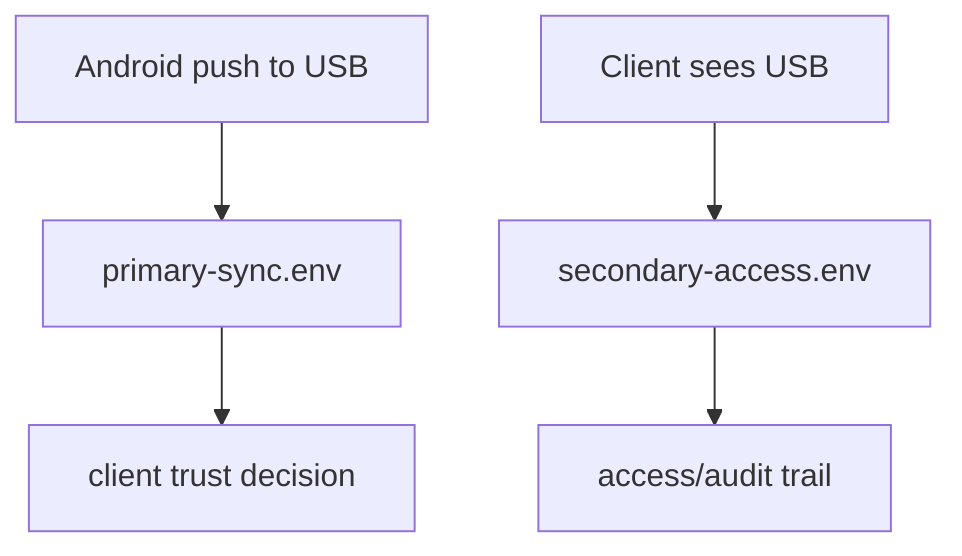

## Sync Model

The current automation is intentionally conservative and asymmetric.

It uses:

```text
rclone copy --update
```

for non-destructive refresh and recovery operations. Automatic behavior refreshes the USB from the Android primary. Backflow from USB to the primary is manual through `nas-mobile-usb-sync recover-primary ... --yes`, and the command blocks by default if the primary is live or the USB cannot prove a recent completed primary sync. Deletes are not propagated yet. This avoids the client or USB silently removing files before manifest-based conflict handling is more mature.

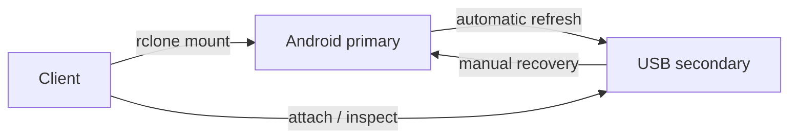

## Security Notes

- Prefer SSH key authentication over password authentication.
- Keep the Android primary on a trusted network.
- Disable battery optimization for Termux and Termux:Boot.
- Review [SECURITY.md](SECURITY.md) before exposing the setup beyond a private network.

## Operator Safety Defaults

- Re-running `setup-nas-mac.sh` preserves existing client settings and fills only missing defaults.
- Re-running `setup-nas-termux.sh` preserves Android-side settings and fills only missing defaults.
- `nas-status` and `nas-doctor` both print a recommended next action instead of only raw state.
- macOS warning notifications are on by default, while informational popups are opt-in through `MAC_NOTIFY_INFO=1`.
- USB-to-primary recovery requires explicit operator confirmation and is never part of automatic watcher behavior.

## Validation

Run on the client:

```bash
make test
```

## Status

The committed baseline is `f478d2b`. The current working tree extends that baseline with:

- 3-device role definitions
- Android and client doctor commands
- USB watcher automation on both Android and macOS
- USB trust manifests
- availability notifications
- low-space client cache mode
