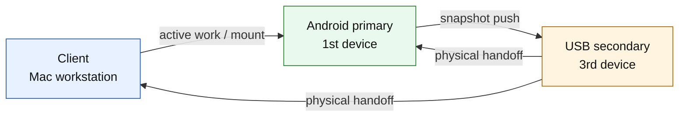

# Architecture

## Purpose

This system is a 3-device storage workflow for a user who actively works on a Mac client, keeps an Android phone as the primary mobile source, and uses a USB stick as a movable secondary source.

The design goal is not high-throughput NAS behavior. The design goal is controlled continuity:

- the client can work directly from the Android primary when it is reachable
- the USB secondary can carry forward a recent snapshot when the Android primary leaves
- the client can warn when the USB cannot prove that it was last refreshed from the primary

## Role Model



### Role definitions

- `client`: the active execution environment. This is where the user edits, builds, and inspects files.
- `Android primary`: the preferred authoritative device in the mobile-first model.
- `USB secondary`: a transportable fallback and handoff medium, not a peer authority.

## Storage Surfaces

### Android primary

```text
/storage/emulated/0/nas/
├── projects
├── experiments
├── claude
├── backups
└── shared
```

### Client

```text
~/mnt/android-nas/<workspace>
~/mnt/android-nas-usb
~/.config/android-nas/config.env
~/.local/state/android-nas/
```

### USB secondary

```text
android-nas/
├── projects
├── experiments
├── claude
├── backups
├── shared
└── .android-nas/
    ├── primary-sync.env
    └── secondary-access.env
```

## Operating Modes

### Mode 1: Primary-connected client

The client mounts a workspace directly from the Android primary over SFTP through `rclone mount`.

Properties:

- convenient when the phone is reachable
- reflects live availability of the primary
- sensitive to Wi-Fi loss, Android background limits, and FUSE behavior

### Mode 2: Secondary-backed continuity

The USB secondary is refreshed from the Android primary, then physically moved to the client when the phone is no longer nearby.

Properties:

- no live dependency on the primary once the USB is present
- only as trustworthy as the last completed primary sync
- avoids a hard stop when the primary leaves

### Mode 3: Low-space client

The client uses `CLIENT_CACHE_MODE=spaceless`, which maps to `rclone --vfs-cache-mode off`.

Properties:

- minimizes local VFS cache growth
- reduces resilience for workloads that expect cached random access or delayed writes
- does not change trust or availability logic

## Control Plane

### Setup commands

- `setup-nas-termux.sh`
- `setup-nas-mac.sh`

These create the local control plane:

- binaries and symlinks
- config files
- state directories
- boot/watcher wiring

### Health commands

- `nas-android-doctor`
- `nas-doctor`
- `nas-status`

These expose the current health model rather than blindly assuming the environment is correct.

## Automation Model

### Android side

`nas-android-usb-watch` is started by Termux:Boot and can also be started immediately by setup.

Its responsibilities are:

1. detect a writable USB path
2. invoke `nas-android-usb-sync push`
3. write a completed primary sync manifest
4. maintain an ongoing notification with quick actions when Termux:API is present

### Client side

`nas-mac-usb-watch` is started by a LaunchAgent.

Its responsibilities are:

1. detect USB insertion/removal
2. link the USB secondary into a stable client path
3. record USB access metadata
4. detect Android primary availability
5. refresh the USB secondary from the Android primary when the primary is reachable
6. warn when the primary is unavailable and the USB has no trustworthy primary-sync manifest
7. keep routine informational state changes quiet unless the operator explicitly enables them

## Trust Model

This system does not yet implement full reconciliation. It implements guarded continuity.

The core trust question is:

```text
If the Android primary is unavailable, can the client trust that the USB secondary was last refreshed from the primary?
```

The current answer is based on the presence of `.android-nas/primary-sync.env`.

If the manifest is present and indicates a completed primary sync, the client can treat the USB as a valid secondary source for continuity purposes.

If the manifest is missing, the client warns instead of silently promoting the USB to trusted status.

If the manifest is stale, recovery back to the primary is also blocked unless the operator forces it explicitly.

## Manifest Semantics

### `primary-sync.env`

This records:

- sync completion status
- epoch and UTC timestamp
- source identity
- source path
- sync scope

Its purpose is operational trust, not cryptographic proof.

### `secondary-access.env`

This records:

- last client-side access timestamp
- client identity
- USB root

Its purpose is auditability and observability, not authority.

## Data Movement Policy

The current sync behavior uses:

```text
rclone copy --update
```

This is deliberately weaker than full bidirectional reconciliation.

Reasons:

- it avoids delete propagation
- it reduces the chance that a stale device erases newer content
- it keeps automatic behavior one-way from primary to secondary
- it reserves USB-to-primary backflow for explicit operator intent

Tradeoff:

- the system cannot yet make strong claims about conflict resolution or global convergence

## System Invariants

The design intends to preserve these invariants:

- the Android device remains the preferred primary source when reachable
- the USB device is never silently trusted without a completed primary-sync signal
- the client can surface primary and secondary availability changes as state transitions
- the first automation layer does not perform destructive sync
- USB-to-primary recovery remains confirmation-gated and is not automatic

## Known Architectural Limits

These are not incidental bugs. They are current design limits.

- The trust model is manifest-based, not reconciliation-based.
- Android USB path discovery is heuristic because Android removable-storage exposure is vendor-dependent.
- `rclone mount` remains sensitive to Android sleep, Wi-Fi instability, and FUSE behavior on the client.
- The USB secondary is linked into the client path; it is not mounted by a dedicated filesystem driver.
- Repeated watcher polling is operationally simple but not especially elegant or power-efficient.

## Why the Design Looks Like This

This repository is trying to solve a real operating constraint:

- the user works on the client
- the Android primary may leave physically
- the USB must be able to bridge that gap

That pushes the system toward explicit roles, explicit timestamps, and explicit warnings. The result is more operational than elegant, but it is aligned with the problem shape.
